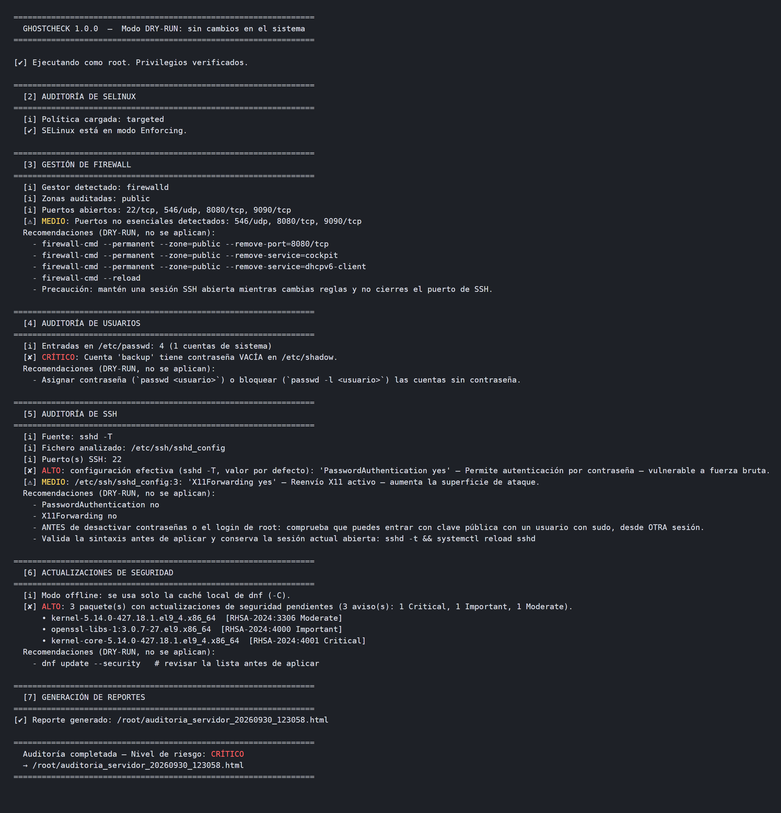
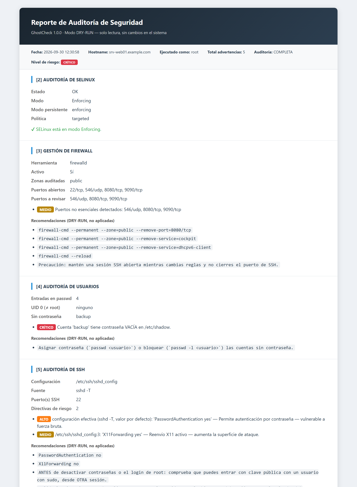

# 👻 GhostCheck

[](https://github.com/jaimefgdev/ghostcheck/actions/workflows/ci.yml)

**🇪🇸 [Español](#-español) · 🇬🇧 [English](#-english)**

---

## 🇪🇸 Español

GhostCheck es una auditoría de seguridad para servidores **RHEL / Rocky / AlmaLinux / CentOS Stream / Fedora** escrita en Python, sin dependencias externas. Revisa SELinux, el firewall, las cuentas locales, la configuración efectiva de SSH y los parches de seguridad pendientes, y genera un informe en TXT, HTML y/o JSON.

Funciona en **modo DRY-RUN**: solo lee el sistema, nunca lo modifica (ver [Garantías DRY-RUN](#garantías-dry-run)).

| Terminal | Informe HTML |
|---|---|
|  |  |

<sub>Capturas de una auditoría sobre un servidor simulado (`python docs/demo/generar_capturas.py`): no se ejecuta nada en un sistema real.</sub>

### Requisitos

- Python **3.9 o superior** (el Python del sistema en RHEL 9 sirve tal cual).
- Privilegios de root (`sudo`). Sin root se puede hacer una auditoría parcial con `--allow-non-root`.
- Pensado para RHEL y derivados. En Debian/Ubuntu funcionan los módulos de firewall (ufw), usuarios y SSH; el de actualizaciones requiere `dnf`.

### Instalación

Elige una opción:

```bash
# 1) Un solo fichero, sin instalar nada
curl -O https://raw.githubusercontent.com/jaimefgdev/ghostcheck/main/ghostcheck.py
sudo python3 ghostcheck.py

# 2) Clonando el repositorio
git clone https://github.com/jaimefgdev/ghostcheck.git
cd ghostcheck
sudo ./ghostcheck.py

# 3) Como paquete Python (instala el comando `ghostcheck`)
pip install git+https://github.com/jaimefgdev/ghostcheck.git

# 4) RPM ya construido: descárgalo de https://github.com/jaimefgdev/GhostCheck/releases/latest
sudo dnf install ./ghostcheck-*.noarch.rpm

# 5) Construyendo el RPM (desde la raíz del repositorio, requiere rpm-build)
rpmbuild -bb --define "_sourcedir $PWD" packaging/ghostcheck.spec
sudo dnf install ~/rpmbuild/RPMS/noarch/ghostcheck-*.noarch.rpm
```

### Uso

```bash
sudo ghostcheck                                  # auditoría completa, reportes TXT + HTML
sudo ghostcheck -o /var/log/ghostcheck -f json   # solo JSON, en otro directorio
sudo ghostcheck --offline                        # dnf solo con caché local
sudo ghostcheck --skip actualizaciones -q        # sin dnf, solo el resumen final
ghostcheck --allow-non-root                      # auditoría parcial sin root
```

| Opción | Descripción |
|--------|-------------|
| `-o, --output-dir DIR` | Directorio de los reportes (por defecto, el actual). |
| `-f, --format LISTA` | Formatos separados por comas: `txt`, `html`, `json` (por defecto `txt,html`). |
| `--skip LISTA` | Módulos a omitir: `selinux`, `firewall`, `usuarios`, `ssh`, `actualizaciones`. |
| `--offline` | `dnf` usa solo su caché (`-C`): no contacta con los repositorios ni toca `/var/cache/dnf` ni `/var/lib/dnf`. |
| `--no-color` | Sin colores ANSI. También se respeta la variable `NO_COLOR`. |
| `-q, --quiet` | Muestra solo el resumen final. |
| `--allow-non-root` | Permite ejecutar sin root. La auditoría se marca como INCOMPLETA. |
| `--version` | Muestra la versión. |

### Códigos de salida

| Código | Significado |
|--------|-------------|
| `0` | Nivel de riesgo BAJO |
| `1` | Nivel de riesgo MEDIO |
| `2` | Nivel de riesgo ALTO |
| `3` | Nivel de riesgo CRÍTICO |
| `4` | Error de uso o de ejecución: argumentos inválidos, sin root, directorio inexistente o reporte no guardado |
| `130` | Interrumpido con Ctrl+C |

### Módulos de auditoría

| # | Módulo | Qué comprueba |
|---|--------|---------------|
| 1 | Privilegios | Ejecución como root (UID 0). |
| 2 | SELinux | Modo en ejecución (`getenforce`), modo persistente en `/etc/selinux/config` y política cargada. |
| 3 | Firewall | firewalld (zona por defecto y zonas activas: puertos, servicios resueltos con `--info-service`, rich rules, redirecciones) o ufw (reglas de entrada, perfiles de aplicación). Marca los puertos distintos de 22/80/443 TCP y de los puertos de sshd. |
| 4 | Usuarios | UID 0 distintos de root; contraseñas vacías en `/etc/passwd` y `/etc/shadow`. |
| 5 | SSH | Configuración **efectiva** con `sshd -T`. Si no está disponible, analiza `sshd_config` con la semántica de sshd: gana el primer valor, `Include` recursivo, bloques `Match` como condicionales y valores por defecto de OpenSSH. Indica fichero y línea de cada hallazgo. |
| 6 | Actualizaciones | Avisos de seguridad pendientes con `dnf updateinfo list --security`, con su severidad. |

### Niveles de riesgo

El nivel global es la **severidad máxima** de los hallazgos:

| Nivel | Hallazgos |
|-------|-----------|
| 🔴 CRÍTICO | Usuario con UID 0 distinto de root · cuenta sin contraseña · `PermitRootLogin yes` · `PermitEmptyPasswords yes` |
| 🟠 ALTO | SELinux deshabilitado · firewall inactivo o ausente · actualizaciones de seguridad pendientes · `PasswordAuthentication yes` · `Protocol 1` |
| 🟡 MEDIO | SELinux Permissive, no persistente o no disponible · puertos no esenciales · reglas de firewall que revisar · `X11Forwarding yes` · directivas de riesgo dentro de un `Match` |
| 🟢 BAJO | Ningún hallazgo |

Si una comprobación no se puede realizar (por ejemplo, `dnf` sin red o `/etc/shadow` ilegible), no sube el nivel de riesgo. En su lugar, la auditoría se marca como **INCOMPLETA** y se indica qué faltó.

### Reportes

```
auditoria_servidor_AAAAMMDD_HHMMSS.txt    # texto plano
auditoria_servidor_AAAAMMDD_HHMMSS.html   # HTML autocontenido
auditoria_servidor_AAAAMMDD_HHMMSS.json   # para automatizar (nivel, hallazgos, errores, datos)
```

- Se crean con permisos **0600**, porque contienen información sensible del servidor.
- Nunca sobrescriben un fichero existente ni siguen enlaces simbólicos.
- Dos ejecuciones en el mismo segundo y en el mismo directorio chocan: la segunda termina con código 4.
- El HTML escapa todos los datos y lleva una Content-Security-Policy que bloquea scripts.

### Garantías DRY-RUN

- GhostCheck solo ejecuta los comandos de una **lista blanca de lectura** (`COMANDOS_PERMITIDOS`): `getenforce`, `sestatus`, `systemctl is-active firewalld`, `firewall-cmd --get-*/--list-*/--info-service`, `ufw status`/`ufw app info`, `sshd -T`, `dnf updateinfo list --security` y `hostname -f`.
- Cualquier otro comando se bloquea antes de ejecutarse.
- Las recomendaciones (`firewall-cmd --remove-port`, `dnf update --security`...) solo se muestran; **nunca se ejecutan**.
- Lo único que escribe GhostCheck son sus reportes.
- Sin `--offline`, el propio `dnf` actualiza su caché de metadatos (`/var/cache/dnf`, `/var/lib/dnf`) al consultar los repositorios. Con `--offline` no toca nada.
- El CI lo verifica en un contenedor Rocky Linux 9 real: toma una huella de `/etc`, `/usr`, `/var/lib`, etc. antes y después de ejecutar GhostCheck y comprueba que no cambia.

### Ejecución periódica

```bash
# /etc/cron.d/ghostcheck — cada lunes a las 06:30, solo JSON
30 6 * * 1 root mkdir -p /var/log/ghostcheck && /usr/bin/ghostcheck -q --no-color -f json -o /var/log/ghostcheck
```

El código de salida (0–3) permite avisar según el nivel de riesgo.

### Limitaciones conocidas

- Solo `dnf` para actualizaciones (no `yum` en RHEL 7 ni `apt`).
- No audita reglas de iptables/nftables creadas fuera de firewalld/ufw.
- Las directivas SSH dentro de bloques `Match` se informan como condicionales, sin evaluar a qué conexiones aplican.
- Los puertos "esenciales" son 22, 80 y 443 TCP más los puertos de sshd.
- Un nivel `BAJO` **no** certifica que el servidor sea seguro (ver el aviso legal).

### Desarrollo

```bash
python3 -m pip install -e ".[dev]"
python3 -m pytest        # los tests simulan todos los comandos y ficheros: no tocan el sistema
ruff check .
mypy
```

- Los tests sustituyen `subprocess.run`, `shutil.which` y las rutas del sistema.
- Tienen su propia lista blanca de comandos: si el código intenta ejecutar un comando fuera de ella, el test falla.
- El CI ejecuta ruff, mypy, los tests en Python 3.9–3.13, la construcción del paquete y la prueba de integración en Rocky Linux 9, que incluye construir e instalar el RPM.

### Estructura

```
ghostcheck.py              # el script completo (se puede copiar y ejecutar tal cual)
tests/                     # pytest
ci/rocky9.sh               # prueba de integración en Rocky Linux 9
packaging/ghostcheck.spec  # RPM
pyproject.toml             # paquete Python y configuración de herramientas
```

### Licencia

Dominio público ([The Unlicense](LICENSE)).

### ⚠️ Aviso legal

GhostCheck se proporciona **TAL CUAL**, sin garantías de ningún tipo.

**Un nivel de riesgo `BAJO` no significa que el servidor sea seguro.** GhostCheck cubre un conjunto concreto de superficies de ataque habituales. Hay muchos otros vectores que no evalúa, como otros servicios mal configurados, la red, la capa de aplicación, la cadena de suministro, los zero-days o los factores humanos.

Úsalo como una capa más de una estrategia de defensa en profundidad. El autor no asume responsabilidad por daños o incidentes derivados de su uso.

---

## 🇬🇧 English

GhostCheck is a security audit for **RHEL / Rocky / AlmaLinux / CentOS Stream / Fedora** servers, written in Python with no external dependencies. It checks SELinux, the firewall, local accounts, the effective SSH configuration and pending security updates, and writes a TXT, HTML and/or JSON report.

It runs in **DRY-RUN mode**: it only reads the system and never changes it (see [DRY-RUN guarantees](#dry-run-guarantees)). Console output and reports are in Spanish.

| Terminal | HTML report |
|---|---|
|  |  |

<sub>Screenshots of an audit of a simulated server (`python docs/demo/generar_capturas.py`): nothing runs on a real system.</sub>

### Requirements

- Python **3.9+** (the system Python on RHEL 9 works as is).
- Root privileges (`sudo`). Without root, `--allow-non-root` runs a partial audit.
- Built for RHEL and derivatives. On Debian/Ubuntu the firewall (ufw), users and SSH modules work; the updates module needs `dnf`.

### Installation

```bash
# 1) Single file, nothing to install
curl -O https://raw.githubusercontent.com/jaimefgdev/ghostcheck/main/ghostcheck.py
sudo python3 ghostcheck.py

# 2) From a clone
git clone https://github.com/jaimefgdev/ghostcheck.git && cd ghostcheck && sudo ./ghostcheck.py

# 3) As a Python package (installs the `ghostcheck` command)
pip install git+https://github.com/jaimefgdev/ghostcheck.git

# 4) Prebuilt RPM: download it from https://github.com/jaimefgdev/GhostCheck/releases/latest
sudo dnf install ./ghostcheck-*.noarch.rpm

# 5) As an RPM (from the repository root, needs rpm-build)
rpmbuild -bb --define "_sourcedir $PWD" packaging/ghostcheck.spec
sudo dnf install ~/rpmbuild/RPMS/noarch/ghostcheck-*.noarch.rpm
```

### Usage

```bash
sudo ghostcheck                                  # full audit, TXT + HTML reports
sudo ghostcheck -o /var/log/ghostcheck -f json   # JSON only, in another directory
sudo ghostcheck --offline                        # dnf uses its local cache only
sudo ghostcheck --skip actualizaciones -q        # skip dnf, print only the summary
```

| Option | Description |
|--------|-------------|
| `-o, --output-dir` | Report directory (default: current directory). |
| `-f, --format` | Comma-separated: `txt`, `html`, `json` (default `txt,html`). |
| `--skip` | Modules to skip: `selinux`, `firewall`, `usuarios`, `ssh`, `actualizaciones`. |
| `--offline` | `dnf -C`: no repository access, no changes to dnf's cache. |
| `--no-color` | No ANSI colours (`NO_COLOR` is honoured too). |
| `-q, --quiet` | Final summary only. |
| `--allow-non-root` | Partial audit without root, marked INCOMPLETE. |

**Exit codes:**

| Code | Meaning |
|------|---------|
| `0` | LOW |
| `1` | MEDIUM |
| `2` | HIGH |
| `3` | CRITICAL |
| `4` | Usage or runtime error |
| `130` | Interrupted |

### Risk levels

The global level is the **highest severity** among the findings:

| Level | Findings |
|-------|----------|
| 🔴 CRITICAL | UID 0 account other than root · empty password · `PermitRootLogin yes` · `PermitEmptyPasswords yes` |
| 🟠 HIGH | SELinux disabled · firewall inactive or missing · pending security updates · `PasswordAuthentication yes` · `Protocol 1` |
| 🟡 MEDIUM | SELinux permissive, not persistent or unavailable · non-essential ports · firewall rules to review · `X11Forwarding yes` · risky directives inside `Match` |
| 🟢 LOW | No findings |

Checks that could not run do not raise the level; they mark the audit as **INCOMPLETE**.

### DRY-RUN guarantees

- Only commands from a **read-only allowlist** are run; anything else is blocked before it executes.
- Recommendations are printed, never executed.
- GhostCheck only writes its own reports, with mode 0600, never overwriting files or following symlinks.
- Without `--offline`, `dnf` itself refreshes its metadata cache (`/var/cache/dnf`, `/var/lib/dnf`).
- CI verifies all of this on a real Rocky Linux 9 container by fingerprinting the filesystem before and after a run.

### Development

```bash
python3 -m pip install -e ".[dev]"
python3 -m pytest && ruff check . && mypy
```

Tests simulate every command and system file and fail if the code tries to run a command outside their own allowlist.

### License

Public domain ([The Unlicense](LICENSE)).

### ⚠️ Disclaimer

GhostCheck is provided **AS-IS**, without warranty of any kind.

**A `LOW` risk level does not mean your server is secure.** GhostCheck covers a specific set of common attack surfaces and cannot detect everything. Use it as one layer of a defence-in-depth strategy. The author assumes no liability for any damage or incident arising from its use.
